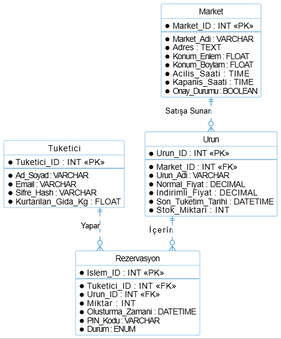

# 🍃 Cepte Kalsın: Akıllı Gıda Takip ve İndirim Platformu

Bu depo, İstanbul Arel Üniversitesi "Yazılım Gereksinim Analizi" ve "Çevik Yazılım Yaklaşımları" dersleri kapsamında geliştirilen *Taze Kalsın* projesinin resmi 1. Sprint Analiz ve Mimari Raporunu içermektedir.

## 🎯 Proje Vizyonu ve Problem Tanımı
Günümüz küresel tedarik zincirinde gıda israfı, hem ekolojik bir kriz hem de devasa bir ekonomik kayıptır.Gıda perakende sektöründeki en büyük operasyonel eksikliklerden biri, raflarda bekleyen ve Son Tüketim Tarihi (S.T.T.) yaklaşan ürünlerin dijital olarak izlenememesi ve etkin bir şekilde yönetilememesidir.Bu durum, satıcılar için doğrudan sermaye kaybı yaratırken, ürünlerin çöpe gitmesine neden olmaktadır.

*Taze Kalsın*, bu probleme dijital ve çevik bir çözüm sunar. Platformumuz; S.T.T.'si yaklaşan ürünleri tespit ederek marketlerin "Flash İndirimler" düzenlemesini sağlarken, tüketicilere anlık lokasyon bazlı bildirimler göndererek israfı önlemeyi ve fırsat eşitliği yaratmayı hedefler.

## 👥 Geliştirme Takımı ve Agile Rol Dağılımı
Projemiz, Scrum çerçevesi temel alınarak Çevik (Agile) prensiplerle yürütülmektedir.
Product Owner (Ürün Sahibi):* Adem Fırat Kaya* - Proje vizyonunun belirlenmesi, iş listesinin (Backlog) önceliklendirilmesi ve paydaş (BİM A.Ş. Mağaza Müdürü) iletişiminden sorumludur.
* Scrum Master:* Hilal Coşkun* - Çevik süreçlerin işletilmesi, Jira/Kanban panosunun yönetimi, takımın önündeki engellerin kaldırılması ve Sprint etkinliklerinin (Planlama, Daily, Retro) yürütülmesinden sorumludur.
* Geliştirme Takımı (Development Team):* Gülçin Civelek*, *Merve Temizler*,* Mehtap Gültepe* - Yazılım gereksinim analizi, UML modelleme, veritabanı mimarisinin inşası, arayüz prototipleme ve uçtan uca kod geliştirme süreçlerini yürütürler

## 🚀 Sprint 1 Hedefleri ve Teknik Çıktılar (Increment)
Bu ilk sprintin temel amacı, projenin teknik ve mantıksal iskeletini inşa etmektir.
1. Mimari Analiz:* Sistemin temel işlevlerini ve aktörlerini belirleyen UML Kullanım Senaryosu (Use Case) modellemes.
2. *Veritabanı Tasarımı:* Yarış durumu (race condition) senaryolarına dayanıklı İlişkisel Varlık (ER) diyagramının çizilmesi.
3. *Fiziksel Altyapı:* Çizilen tasarımın T-SQL (Microsoft SQL Server) üzerinde ayağa kaldırılması ve test verileriyle doğrulanması.
## 📊 UML Modelleme ve Analiz (Teknik Doğruluk ve Tutarlılık)

Hocamızın belirlediği değerlendirme kriterlerine uygun olarak, projenin teknik iskeleti standartlara uygun UML diyagramları ile modellenmiştir. Use Case diyagramımızdaki her işlev, Jira'daki bir "User Story" kartı ile birebir örtüşerek model-yönetim tutarlılığını sağlamaktadır .

### A. Kullanım Senaryosu (Use Case) Diyagramı

Bu diyagram, Taze Kalsın platformunun temel aktörlerini, sistem sınırlarını ve aktörlerin sistemle etkileşimlerini görselleştirmektedir .

*Detaylı Modelleme Analizi:*
Diyagramımızda 3 ana insan aktörü (Tüketici, Market Sahibi, Sistem Yöneticisi) ve 2 dış sistem aktörü (Konum API, Bildirim Servisi) tanımlanmıştır.

1.  *Tüketici Senaryoları:* Temel hedefi gıda israfını önlerken tasarruf etmek olan tüketici için ; "Konum İzni Ver" Use Case'i, dış aktör "Konum API"yi <<include>> ilişkisiyle dahil ederek kullanıcının çevresindeki marketleri tespit eder . "Ürünü Kısa Süreli Ayırt (Rezervasyon)" işlevi, projenin kalbi olup, başarılı rezervasyon sonrası "Bildirim Servisi"ni <<include>> ile tetikleyerek onay PIN'ini gönderir.
2.  *Market Sahibi Senaryoları:* Tarihi yaklaşan ürünleri hızlıca sisteme yükleme hedefine uygun olarak; "S.T.T. Yaklaşan Ürün Ekle" ve "Son Şans Paketi Oluştur" Use Case'leri veri girişini sağlar. "QR/PIN ile Satışı Doğrula" işlevi, sistemin rezervasyon mantığını tamamlar.
3.  *Sistem Yöneticisi Senaryoları:* Platform trafiğini ve önlenen israfı raporlama hedefine uygun olarak; "Market Başvurularını Onayla/Reddet" Use Case'i, platformun güvenliğini sağlar (bu işlev veritabanında Market.Onay_Durumu alanı ile doğrudan desteklenmektedir.

---

## 🗄️ Mantıksal Veritabanı Tasarımı (ERD)

Projenin veri yapısını gösteren model , projenin vizyonu doğrultusunda gıda israfını önleyecek ve veri bütünlüğünü sağlayacak şekilde tasarlanmıştır. 

*Detaylı Tasarım ve İlişki Analizi:*

Tasarımımızda 4 ana varlık (tablo) ve bu varlıklar arasındaki katı ilişkisel kurallar tanımlanmıştır.

1.  *Varlıklar ve Kısıtlamalar:*
    * Market: Market_ID birincil anahtarına (PK) sahiptir. Adres, Konum_Enlem/Boylam, Saatler ve Admin Use Case'ini destekleyen Onay_Durumu (BOOLEAN) alanlarını barındırır.
    * Tuketici: Tuketici_ID (PK) barındırır. Kg_Kurtarilan (FLOAT) alanı ile platformun toplumsal vizyonu olan önlenen israf miktarını takip eder .
    * Urun: Urun_ID (PK) barındırır. Normal_Fiyat ve Indirimli_Fiyat alanları, flash indirimleri yönetmek için DECIMAL veri tipinde tanımlanmıştır. STT (Son Tüketim Tarihi) alanı, sistemin temel mantığını oluşturur.
    * Rezervasyon (İşlem): Islem_ID (PK) barındırır. Tuketici_ID ve Urun_ID alanlarını yabancı anahtar (FK) olarak barındırarak tüketici ve ürünü birbirine bağlar. Miktar, Zaman, PIN ve Durum alanlarını barındırır.

2.  *İlişki Mantığı (Relational Integrity):*
    * Market ve Ürün arasında *1'e Çok (1:N)* ilişki vardır (Satışa Sunar). Bir marketin birden çok tarihi yakın ürünü olabilir.
    * Tüketici ve Rezervasyon arasında *1'e Çok (1:N)* ilişki vardır (Yapar). Bir tüketici birden çok rezervasyon yapabilir.
    * Ürün ve Rezervasyon arasında *1'e Çok (1:N)* ilişki vardır (İçerir). Bu kritik bir ilişkidir; *aynı ürünün farklı rezervasyonlarda yer alması, "yarış durumu" (race condition) analizimiz için temel veri yapısını oluşturur.*

3.  *Teknik Uyum:* ER diyagramındaki veri tipleri ve kısıtlamalar, "Sürüm Kontrolü" aşamasında (GitHub/Commit Disiplini ) T-SQL kodlarına birebir dönüştürülerek fiziksel kurulum tamamlanmıştır.
## Fiziksel Veritabanı Kurulumu ve Testi

Projenin mantıksal veri modeli (ERD); veri bütünlüğü, ACID standartları ve "aynı ürünü iki kişinin rezerve etmesini önleme (yarış durumu/race condition)" senaryosu göz önüne alınarak *T-SQL (Microsoft SQL Server)* üzerinde fiziksel olarak inşa edilmiştir.

*Tamamlanan Altyapı Adımları:*
* Tuketici, Market, Urun ve Rezervasyon tabloları oluşturulmuş, Primary Key (PK) ve Foreign Key (FK) ilişkileri kurularak ilişkisel bütünlük sağlanmıştır.
* Sistemin ilişkisel mantığını doğrulamak amacıyla tablolara örnek test verileri (Mock Data) girilmiştir.
* Parçalı veriler INNER JOIN sorgusuyla birleştirilerek anlamlı bir rapora dönüştürülmüş ve projenin veritabanı iskeleti %100 oranında doğrulanmıştır.

*Veritabanı Mimari Kurulum ve JOIN Testi Ekran Görüntüsü:*

---
Bu doküman, İstanbul Arel Üniversitesi *"Yazılım Gereksinim Analizi"* ve *"Yazılımda Çevik Yaklaşımlar"* dersleri ortak proje gereksinimleri kapsamında, 1. Sprint resmi çıktısı (Increment) olarak hazırlanmıştır.
